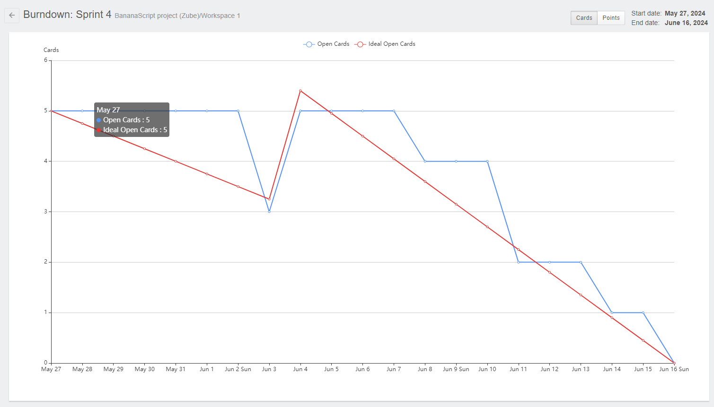

# SPRINT 04
> Projeto desenvolvido pela equipe <a href='https://github.com/BananaaScript' target="_blank">BananaScript</a>.
# :scroll: Resumo do que foi feito nessa Sprint 

### MVP (Minimum Viable Product):  Entrega do Produto Final.

 - ALteração do metodo de visualização de valores dos ativos no passado
 - Desenvolvimento do Historico de Ativos, contendo qualquer alteração feita pelo usuário.
 - Adição da dados de nota fiscal ao ativo.

### :checkered_flag: Entregas das Sprints
| Links | Entregas de Valor / MVP (Minimum Viable Product) | Período | Status |
|:-----:|:------------------:|:---------:|:--------:|
| <a href=''>Sprint 1 </a> | Desenvolvimento das funcionalidades: adicionar, editar e deletar os ativos, modelos e categorias. Além de uma visualização geral por modelos e categorias. | 25/03/2024 - 14/04/2024 | Entregue :heavy_check_mark: |
| <a href=''>Sprint 2 </a> | Desenvolvimento da interface e sistema de notificações, incluindo inserção de dados de manutenções como estado, responsável, entre outros. | 15/04/2024 - 05/05/2024 | Entregue :heavy_check_mark: |  
| <a href=''>Sprint 3 </a> | Desenvolvimento de sistema monitoramento de ativos de forma individual e por meio de relatorios gerias| 06/05/2024 - 26/05/2024 | Entregue :heavy_check_mark: | 
| <a href=''>Sprint 4 | Desenvolvimento de funcionalidades finais para o sistema | 27/05/2024 - 16/06/2024 | Entregue :heavy_check_mark: |

### :hourglass: Data de desenvolvimento da sprint
| 27/05/2024 - 16/06/2024 | **<a href='https://github.com/BananaaScript/SGA' target="_blank">Visualizar entregas**</a> |

 

## Backlog Da Sprint
| Número | Atividade | Descrição | Sprint Points | Prioridade | Responsavel |  
|:--:|:------------:|:-----------:|:----------:|:------:|:------------:|
|  01  | (Back-end) - Histórico dos ativos | Desenvolver um sistema que guarde as informações relevantes de cada ativo, pode ser salva em arquivo json. | 14 | Alta | Miguel Conde |
|  02  | (Front-end) - Total de Ativos por Categoria e Financeiro | Exibir para o usuário, de forma gráfica e escrita, a quantidade de ativos por categoria e quantos reais foi investido naquela categoria. | 8 | Alta | Douglas Medeiros |
|  03  | (Back-end) - Total Ativos e Total Financeiro GERAL | Desenvolver sistema que seja capaz de trazer TOTAL de ATIVOS que a empresa tem e TOTAL de FINACEIRO que ela possui investido em todo tipo de ativos. | 12 | Alta | Gabriel Siqueira e Lucca Vilela |
|  04  | (Front-end) - Total Ativos | Exibir ao front o total em ativos que a empresa tem e mostrar o valor total investido. Puxar infos da task 39 | 8 | Média | Kaue Riki |
|  05  | (Backend) - Upload de arquivos (NFe) | Desenvolver upload de arquivos, que no caso o cliente possa subir a Nota Fiscal Eletrônica do ativo que ele adquiriu, adicionar essa função no cadastro do ativo. Armazenar essa nota em um diretório apropriado | 16 | Média | Gabriel Siqueira |
|  06  | (Backend) - Gráficos Mensal | Em TODOS os gráficos já feitos, adicionar o filtro para exibir as informações correspondentes ao mês em questão | 18 | Média | Lucca Vilela |
|  07  | (Back-end) - Ativos por categoria | Desenvolver sistema que calcule a quantidade de ativo em cada categoria e calcule o total de capital investido em cada categoria. | 16 | Média | Lucca Vilela |
|  08  | (Frontend) - Botão Upload | Adicionar na tela de cadastro um botão para poder fazer o upload de arquivos (Nota Fiscal); | 16 | Baixa | Douglas Medeiros |

 

##  Burndown 
### :open_book: Dicionário:
**Dados:** O gráfico abaixo avalia as tasks (Tarefas) por dias (Tempo): 
 **Linha Azul**: Tasks Concluidas na Sprint
 **Linha Vermelha**: Ideal de Tasks por Tempo
### Burndown da Sprint 

  
## :desktop_computer: Tecnologias Utilizadas nesta sprint

| :arrow_up: [Voltar ao topo](#topo) | ⬅️ [Voltar para página principal](https://github.com/BananaaScript/SGA)
