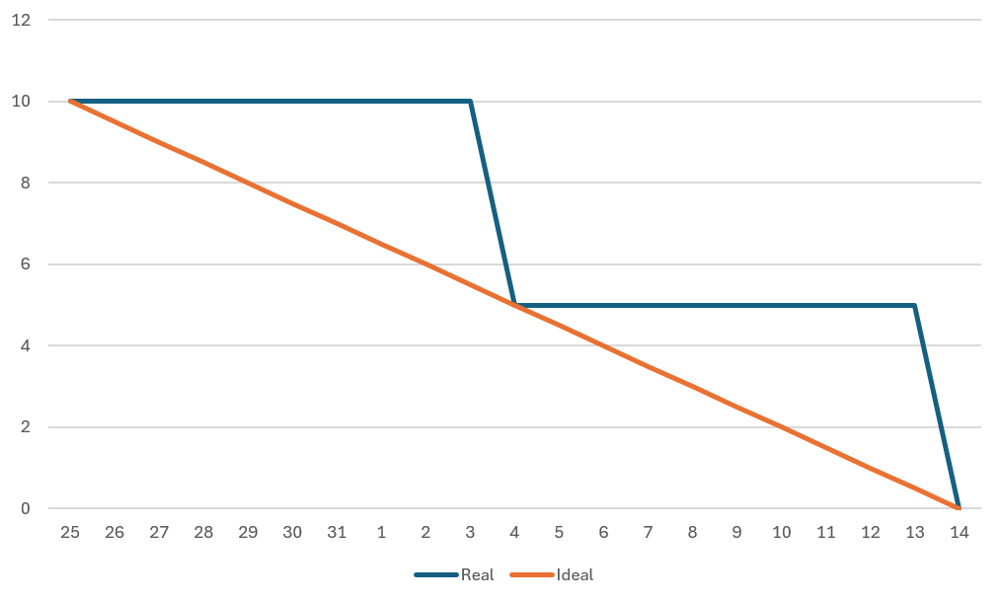
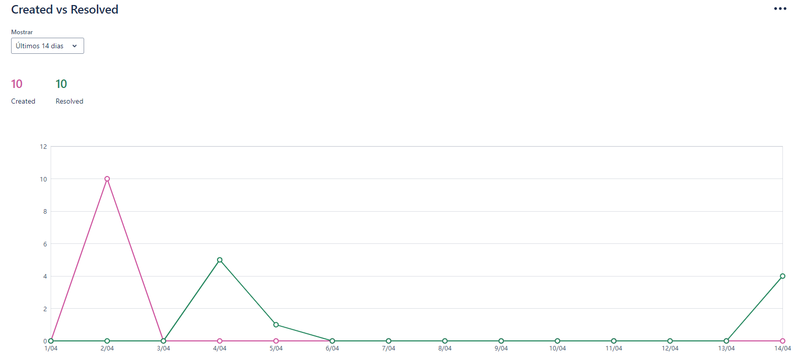

# SPRINT 01
> Projeto desenvolvido pela equipe <a href='https://github.com/BananaaScript' target="_blank">BananaScript</a>.
# :scroll: Resumo do que foi feito nesa Sprint 

### MVP (Minimum Viable Product):  Desenvolvimento das funcionalidades: adicionar, editar e deletar os ativos, modelos e categorias. Além de uma visualização geral por modelos e categorias.

 - Desenvolvimento da funcionalidades de adicionar, editar e deletar os ativos, modelos e categorias.
 - Visualizar todos os modelos e categorias de forma única.
 - Estruturalização do Projeto, incluindo telas em desenvolvimento.

### :checkered_flag: Entregas das Sprints
| Links | Entregas de Valor / MVP (Minimum Viable Product) | Período | Status |
|:-----:|:------------------:|:---------:|:--------:|
| <a href=''>Sprint 1 </a> | Desenvolvimento das funcionalidades: adicionar, editar e deletar os ativos, modelos e categorias. Além de uma visualização geral por modelos e categorias. | 25/03/2024 - 14/04/2024 | Entregue :heavy_check_mark: |
| <a href=''>Sprint 2 </a> | Desenvolvimento da interface e sistema de notificações, incluindo inserção de dados de manutenções como estado, responsável, entre outros. | 15/04/2024 - 05/05/2024 | Em desenvolvimento :hourglass: |  
| <a href=''>Sprint 3 </a> | Desenvolvimento de sistema de busca e analise de ativos de forma individual, incluindo busca por localização, responsável e data de manutenção | 06/05/2024 - 26/05/2024 | Em desenvolvimento :hourglass: | 
| <a href=''>Sprint 4 | Desenvolvimento da interface de relatórios, incluindo gráficos e tabelas  | 27/05/2024 - 16/06/2024 | Em desenvolvimento :hourglass: |

### :hourglass: Data de desenvolvimento da sprint
|  25/03/2024 - 14/04/2024 | **<a href='https://github.com/BananaaScript/SGA' target="_blank">Visualizar entregas**</a> |

## Como rodar o projeto :question:
  Como ainda não foi feito o *deploy*, é necessário que rode o projeto localmente na sua máquina, você pode conferir os passos para rodar [aqui](https://github.com/BananaaScript/SGA/blob/main/ComoRodar.md).
 
 

## Backlog Da Sprint
| Número | Atividade | Descrição | Sprint Points | Prioridade | Responsavel |  
|:--:|:------------:|:-----------:|:----------:|:------:|:------------:|
|  01  | (Frontend) Desenvolvimento/ Formatação das telas de Cadastro | Desenvolvimento da tela que possibilita o cadastro de novos: categorias, modelos e ativos.| 5 | Alta | Bruno Henrique |
|  02  | (Frontend) Desenvolver barra de navegação lateral | Desenvolver e estilizar a barra lateral que permite a navegação entre as paginas do sistema. | 8 | Alta | Bruno Fernandes |
|  03  | (Frontend) Desenvolver projeto react | Organizar arquivos, desenvolver sistema de navegações respeitando os principios de uma pagina Spa (Single Page Aplication). | 13 | Alta | Gabriel Henrique |
|  04  | (Frontend) Desenvolver visualização completa das categorias e modelos | Desenvolver tabela de visualização de todos as categorias ou modelos já cadastrados. | 13 | Alta | Douglas Medeiros |
|  05  | (Backend) Desenvolver sistema de cadastrar, editar e deletar de Ativos | Desenvolver o Crud(Create, Read, Update e Delete) dos dados cadastrados na tabela ativos do banco de dados. | 13 | Alta | Miguel Conde |
|  06  | (Backend) Desenvolver sistema de cadastrar, editar e deletar de Categorias | Desenvolver o Crud(Create, Read, Update e Delete) dos dados cadastrados na tabela categorias do banco de dados.| 13 | Alta | Gabriel Henrique |
|  07  | (Backend) Desenvolver sistema de cadastrar, editar e deletar de Modelos | Desenvolver o Crud(Create, Read, Update e Delete) dos dados cadastrados na tabela modelos do banco de dados.| 13 | Alta | Lucca Loyale |
|  08  | (Frontend) Desenvolver tela home | Desenvolver a tela Home, mesmo que incompleta, que mostre os dados do usuario logado. | 8 | Média | Douglas Medeiros |
|  09  | (Backend) Desenvolver sistema de banco de dados | Desenvolver o banco de dados MySQL com tabelas de ativos, modelos e categorias. | 5 | Média | Miguel Conde |
|  10  | (Frontend) Desenvolver tela de login | Desenvolver apenas a parte visual do login. | 13 | Média | Kaue Riki |
 

##  Burndown 
### :open_book: Dicionário:
**Dados:** O gráfico abaixo avalia as tasks(tarefas) por dias(Tempo): 
 **Linha Azul**: Tasks Concluidas na Sprint
 **Linha Vermelha**: Ideal de Tasks por Tempo
### Burndown da Sprint (Formatado)

### Burndown da Sprint (Direto do Jira)

  
## :desktop_computer: Tecnologias Utilizadas nesta sprint

## Demonstração da entrega
Foi gravado uma demonstração da entrega desta sprint, você pode conferir no [*youtube*](https://www.youtube.com/watch?v=001gbu85vyI) da equipe.

| :arrow_up: [Voltar ao topo](#topo) | ⬅️ [Voltar para página principal](https://github.com/BananaaScript/SGA)
