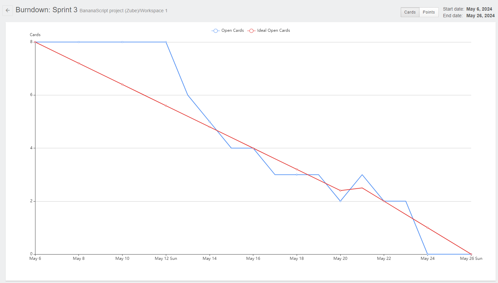

# SPRINT 03
> Projeto desenvolvido pela equipe <a href='https://github.com/BananaaScript' target="_blank">BananaScript</a>.
# :scroll: Resumo do que foi feito nessa Sprint 

### MVP (Minimum Viable Product):  Monitoramento do ativo, sendo possível ter controle do ativo, ele estando dentro ou fora da empresa.

 - Desenvolvimento de funcionaliades relacionadas a localização, ao estado fisico, a data das próximas manutenções e ao responsavel pelo ativo.
 - Desenvolvimento das funcionalidade de Adicionar e Editar usuários no sistema.
 - Desenvolvimento de alguns Gráficos para os relatórios.

### :checkered_flag: Entregas das Sprints
| Links | Entregas de Valor / MVP (Minimum Viable Product) | Período | Status |
|:-----:|:------------------:|:---------:|:--------:|
| <a href=''>Sprint 1 </a> | Desenvolvimento das funcionalidades: adicionar, editar e deletar os ativos, modelos e categorias. Além de uma visualização geral por modelos e categorias. | 25/03/2024 - 14/04/2024 | Entregue :heavy_check_mark: |
| <a href=''>Sprint 2 </a> | Desenvolvimento da interface e sistema de notificações, incluindo inserção de dados de manutenções como estado, responsável, entre outros. | 15/04/2024 - 05/05/2024 | Entregue :heavy_check_mark: |  
| <a href=''>Sprint 3 </a> | Desenvolvimento de sistema monitoramento de ativos de forma individual, incluindo busca por localização, responsável e data de manutenção | 06/05/2024 - 26/05/2024 | Entregue :heavy_check_mark: | 
| <a href=''>Sprint 4 | Desenvolvimento da interface de relatórios, incluindo gráficos e tabelas | 27/05/2024 - 16/06/2024 | Em desenvolvimento :hourglass: |

### :hourglass: Data de desenvolvimento da sprint
| 06/05/2024 - 26/05/2024 | **<a href='https://github.com/BananaaScript/SGA' target="_blank">Visualizar entregas**</a> |

## Como rodar o projeto :question:
  Como ainda não foi feito o *deploy*, é necessário que rode o projeto localmente na sua máquina, você pode conferir os passos para rodar [aqui](https://github.com/BananaaScript/SGA/blob/main/ComoRodar.md).
 
 

## Backlog Da Sprint
| Número | Atividade | Descrição | Sprint Points | Prioridade | Responsavel |  
|:--:|:------------:|:-----------:|:----------:|:------:|:------------:|
|  01  | (Frontend) Desenvover sistemas de busca de ativos por caracteristicas | Desenvolver sistema de busca por nome ou área(Coluna) referente a pagina. | 6 | Alta | Bruno Fernandes |
|  02  | (Frontend) Correção de erros do Sistema | Corrigir erros ou falta de funcionalidades que o sistema apresenta | 14 | Alta | Douglas Medeiros |
|  03  | (Backend) ativo indisponível quando entrar em manutenção | Desenvolver um sistema que mostre quando o ativo entrar em manutenção ele fique indisponível no sistema para ser atribuído para alguém CASO ele esteja disponível. | 6 | Alta | Gabriel Siqueira |
|  04  | (Frontend) Estado do Ativo | Exibir o estado do ativo quando ele for pesquisado de forma individual. | 2 | Alta | Kaue Riki |
|  05  | (Backend) Desenvolvimento de sistemas que calculem os dados para torna-los relatorios | Desenvolver um sistema que calcule a soma de todos os ativos, o total de seus valores (Somados) e uma porcentagem do quanto subiu ou desceu seu valor monetário. | 16 | Média | Lucca Loyale |
|  06  | (Frontend) Desenvolver sistema de filtros nas telas de relatório | Alterar os campos da barra superior das telas de navegação, ou seja, adicionar as opções de visualizar relatórios de categorias e modelos. Após isso desenvolver um select com TODAS as categorias ou modelos para gerar um relatório sobre. | 8 | Média | Douglas Medeiros |
|  07  | (Frontend) Filtrar dados da pagina home por usuario logado | Alterar a tabela da tela home e os dados do usuario por usuario Logado | 8 | Média | Miguel Conde |
|  08  | (Frontend) Desenvolver gráficos de relatorios | Desenvolver tela com dashboards e gráficos que apresentem os ativos de um determinado modelo ou categoria. | 16 | Média | Kaue Riki |
|  09  | (Frontend) Alterar o layout de todas as tabelas do sistema | Alterar o css/ Layout das tabelas do sistema e implementa-los em todas as paginas que possuem tabelas. De preferencia criar um layout semelhante a uma lista que, ao ser clicado, abre uma aba com mais dados sobre o item clicado. | 5 | Baixa | Kaue Riki |
|  10  | (Backend) Aprimoramento do sistema de envio do email | A partir do dia em que uma notificação alterar seu estado (Atrasado, em 3 dias ou em 15 dias) enviar um email ao usuario responsavel que avise-o que há ativos em sua posse que precisaam/ Precisarão de manutenção. | 14 | Baixa | Gabriel Siqueira |

 

##  Burndown 
### :open_book: Dicionário:
**Dados:** O gráfico abaixo avalia as tasks (Tarefas) por dias (Tempo): 
 **Linha Azul**: Tasks Concluidas na Sprint
 **Linha Vermelha**: Ideal de Tasks por Tempo
### Burndown da Sprint 

  
## :desktop_computer: Tecnologias Utilizadas nesta sprint

| :arrow_up: [Voltar ao topo](#topo) | ⬅️ [Voltar para página principal](https://github.com/BananaaScript/SGA)
