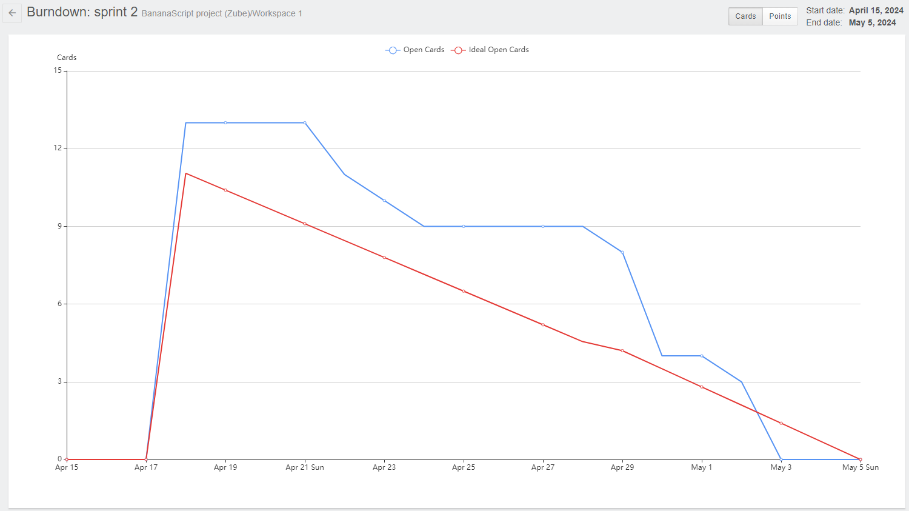

# SPRINT 02
> Projeto desenvolvido pela equipe <a href='https://github.com/BananaaScript' target="_blank">BananaScript</a>.
# :scroll: Resumo do que foi feito nessa Sprint 

### MVP (Minimum Viable Product):  Desenvolvimento do sistema que notifica o usuário caso haja ativos que precisem urgentemente de manutenção ou que possuam uma data agendada previamente próxima.

 - Desenvolvimento do sistema que notifica o usuário caso haja ativos que precisem de manutenção.
 - Visualizar todos os ativos que possuem datas programadas para futuras manutenções, separados por ativos com datas expiradas e ativos com datas futuras.
 - Desenvolvimento do relacionamento de dados não só entre ativos, modelos e categorias, mas também entre responsável, estado e as datas programadas de manutenção.

### :checkered_flag: Entregas das Sprints
| Links | Entregas de Valor / MVP (Minimum Viable Product) | Período | Status |
|:-----:|:------------------:|:---------:|:--------:|
| <a href=''>Sprint 1 </a> | Desenvolvimento das funcionalidades: adicionar, editar e deletar os ativos, modelos e categorias. Além de uma visualização geral por modelos e categorias. | 25/03/2024 - 14/04/2024 | Entregue :heavy_check_mark: |
| <a href=''>Sprint 2 </a> | Desenvolvimento da interface e sistema de notificações, incluindo inserção de dados de manutenções como estado, responsável, entre outros. | 15/04/2024 - 05/05/2024 | Entregue :heavy_check_mark: |  
| <a href=''>Sprint 3 </a> | Desenvolvimento de sistema de busca e análise de ativos de forma individual, incluindo busca por localização, responsável e data de manutenção | 06/05/2024 - 26/05/2024 | Em desenvolvimento :hourglass: | 
| <a href=''>Sprint 4 | Desenvolvimento da interface de relatórios, incluindo gráficos e tabelas | 27/05/2024 - 16/06/2024 | Em desenvolvimento :hourglass: |

### :hourglass: Data de desenvolvimento da sprint
| 25/03/2024 - 14/04/2024 | **<a href='https://github.com/BananaaScript/SGA' target="_blank">Visualizar entregas**</a> |

## Como rodar o projeto :question:
  Como ainda não foi feito o *deploy*, é necessário que rode o projeto localmente na sua máquina, você pode conferir os passos para rodar [aqui](https://github.com/BananaaScript/SGA/blob/main/ComoRodar.md).
 
 

## Backlog Da Sprint
| Número | Atividade | Descrição | Sprint Points | Prioridade | Responsavel |  
|:--:|:------------:|:-----------:|:----------:|:------:|:------------:|
|  01  | (Frontend) Desenvolver interface da tela Home. | Desenvolver a segunda parte da tela home, que inclui uma tabela que possua os ativos e suas datas de manutenções agendadas, um interface do perfil logado, que permita o usuário sair de sua conta e os pop-up das notificações referentes as manutenções agendadas. | 8 | Alta | Douglas Medeiros |
|  02  | (Backend) Desenvolver sistema de notificações aos destinatários. | Desenvolver sistema que defina se um ativo está expirado ou não com base na sua data de manutenção. | 12 | Alta | Gabriel Siqueira |
|  03  | (Backend) Re-estruturar dados dos ativos, modelos, categorias, destinatarios e administradores no banco de dados. | Alterar os campos que estão cadastrados no banco de dados, alterar os metodos do backend e os inputs do frontend. | 2 | Alta | Miguel Conde |
|  04  | (Backend) Desenvolver relacionamentos de um ativo com seu local, responsável, data manutenção, entre outros. | Apos os campos do banco de dados serem inseridos, gerar um relacionamento entre eles. | 4 | Alta | Gabriel H. e Lucca L. |
|  05  | (Frontend ) Alterar inputs do sistema, permitindo receber apenas dados semelhantes. | Verificar se os inputs do sistema aceitam apenas dados semelhantes. Por exemplo: um telefone deve aceitar numeros no padrao: (xx) xxxxx-xxxx. | 2 | Alta | Gabriel Siqueira |
|  06  | (Frontend) Desenvolver telas de Notificações. | Desenvolver de forma semelhante as telas propostas no wireframe, portanto agora dividindo a interface na tela de ativos cuja a data de manutenção ainda não expirou e outra tela com ativos cuja sua data já está expirada. | 7 | Alta | Bruno Fernandes | 
|  07  | (Backend) Desenvolver o relacionamento entre ativos, modelos e categorias no banco de dados (Dependências). | Desenvolver um sistema de hierarquia entre a categoria, modelo e ativo. De forma que: um ativo pertence a um modelo e um modelo pertence a uma categoria. | 3 | Alta | Lucca Loyale |
|  08  | (Backend) Desenvolver diferença de privilegios entre destinatarios e Adms. | Desenvolver verificação de privilégios (Roles) no backend, alem do desenvolvimento do sistema de login. Caso o usuario seja um destinatario, exclua a barra de navegação lateral. Caso seja um administrador permita-o navegar entre as funcionalidades do sistema. | 7 | Média | Miguel Conde |
|  09  | (Frontend) Implementação do sistema do Login no front. | Implementar o sistema de login no frontend, mais especificamente, inserir o sistema de verificação de credenciais na pagina de login. | 12 | Média | Miguel Conde |
|  10  | (Frontend) Re-estruturar a estrutura e design das interfaces. | Re-estruturar as interfaces das do sistema, incluindo as barras de navegação, as interfaces de cadastro e a visualização de itens cadastrados pelo usuário. | 8 | Média | Bruno Fernandes |
|  11  | (Backend) Desenvolver o CRUD dos usuários (Destinatarios e Administradores) e relaciona-lo as outras tabelas. | Criação da tabela no banco de dados chamada usuários, que possua os dados de todos os usuários, sejam eles administradores ou não. | 2 | Média | Miguel Conde |
|  12  | (Frontend) Adição de tabelas com dados ja cadastrados nas páginas de cadastro. | Adicionar a visualização dos items ja cadastrados, sejam eles ativos, modelos, categorias, destinatarios ou administradores, nas interfaces de cadastro. | 3 | Média | Kaue Riki |
|  13  | (Frontend) Adição de sistema de busca para todas as tabelas do sitema. | Adicionar sistema de visualização das tabelas pelo dado inserido do usuario e em caso positivo, mostrar apenas ele. Em caso negativo, mostrar uma mensagem de não encontrado | 2 | Média | Kaue Riki |
|  14  | (Backend) Aprimorar sistema de notificações para enviar e-mail ao destinatário. | Após desenvolver o sistema de notificações, o cliente gostaria que as notificações fossem enviadas por e-mail para os usuarios destinatarios refentes as datas de expirações dos ativos que ele possui. | 7 | Baixa | Bruno Henrique |
 

##  Burndown 
### :open_book: Dicionário:
**Dados:** O gráfico abaixo avalia as tasks (Tarefas) por dias (Tempo): 
 **Linha Azul**: Tasks Concluidas na Sprint
 **Linha Vermelha**: Ideal de Tasks por Tempo
### Burndown da Sprint 

  
## :desktop_computer: Tecnologias Utilizadas nesta sprint

| :arrow_up: [Voltar ao topo](#topo) | ⬅️ [Voltar para página principal](https://github.com/BananaaScript/SGA)
